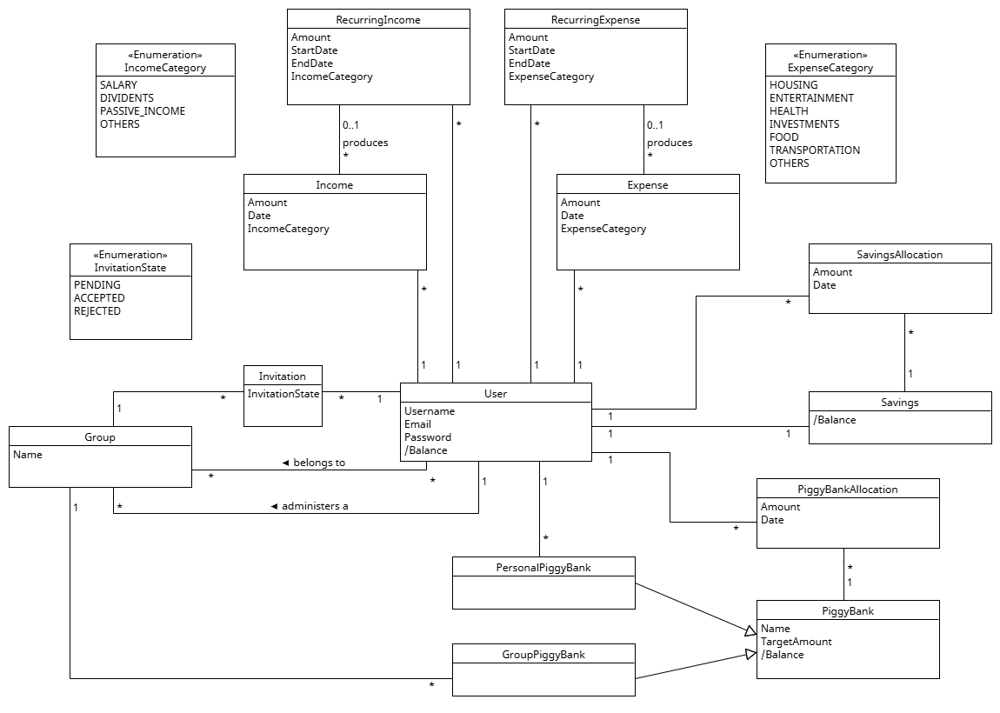

### Budget Management Service

---

The **Budget Management Service** empowers users to track their finances, manage expenses, and save money, either individually or within a group. Each user has full control over their personal account, recording income and expenses while organizing them into categories. For structured saving, users can create **Piggy Banks**, which function as dedicated savings accounts.

For collaborative financial planning, users can form or join **Groups**, where an **Admin** creates and manages the group and invites new members. Within a group, members can contribute to **Group Piggy Banks**, allowing collective savings toward shared financial goals. While all members can add funds, only the Admin can dissolve the piggy bank, ensuring structured financial oversight.

To enhance financial awareness, the platform generates **Reports**, offering both individual and group-level insights. Users can analyze monthly and annual spending trends, track savings progress, and optimize their budgeting strategies. This structured yet flexible system supports both personal financial independence and collaborative money management.

---
**Core Functionalities**:
**User registration & Accounts**: Users can register to the financial management system
**Financial Expense/Income entries**: Users can insert recurring or non-recurring finacial records that belong to various categories
**Piggy Bank Creation**: Users can create one or multiple personal piggy banks that serve as dedicated saving accounts
**Reporting**: Users can create and view monthly or annual reports based on their financial entries

---
#### **1. User registration & Accounts**
Users can create autonomous accounts in the financial management system by providing email and password.
Each user can invite other users with autonomous accounts to join a Group. The user who sends the invitation becomes the **Admin** of the Group.
The user invited to join a group can Accept or Reject the invitation. The invitation states are: Pending, Accepted, Rejected. Every user can belong only to one Group.
The user account keeps a state of his Available Funds. This is calculated as following:
Income - (Expenses + Savings + Piggy Banks).

---

#### **2. Financial Expense/Income entries**
A user can add Expense or Income entries to the system, which can be either fixed or variable. Entries can also be recurring or non-recurring. Recurring entries have start and end date, and they are automatically displayed in the user’s records respectively.

Expenses entries can belong to the following categories:
- Housing
- Entertainment
- Health & Medical
- Investments
- Food
- Transportation
- Salary
- Dividents
- Passive Income
- Others  

Income entries can belong to the following categories:
- Salary
- Dividents
- PassiveIncome
- Others

---

#### **3. Piggy Bank Creation**:
Users can create multiple individual piggy banks each having a dedicated goal (e.g. Travel, New Car etc.), as well as a target amount. Users can only add money to a piggy bank and not withdraw.
In case of Groups, only the Admin can create one **group piggy bank** for all Group members.
In a group piggy bank all members can only add money.
Only the Admin is eligible to dissolve the piggy bank (e.g. in case of an error or a change in goals). By this action, the amount of money will be returned to each member respectively.
A specific type of piggy bank are **Savings**, where users can both add or remove money if needed. In case of money removal, the amount returns in the available funding. Savings are individual, and cannot be created for a Group.

---

#### **4. Reports**
  Users can generate and view reports for expenses and income entries, either individually or as group reports.
  **Individual Reports**:
  Users can generate reports for their own financial entries, filtering by month, year or category. Some report examples are provided below:
    **Monthly**:
    - Monthly budget (Income - Expenses)
    - Income/Expenses by category
    - Savings goals
    **Annual**:
    - Income/Expenses by category  
    - Savings goals

  **Group Reports**:
  In case a user belongs to a group can also generate reports on the group financial entries. Some report examples are provided below:
    **Monthly**:
    - Income/Expenses by category 
    - Savings goals
    **Annual**:
    - Income/Expenses by category.  
    - Savings goals.  

---
## Domain Model

