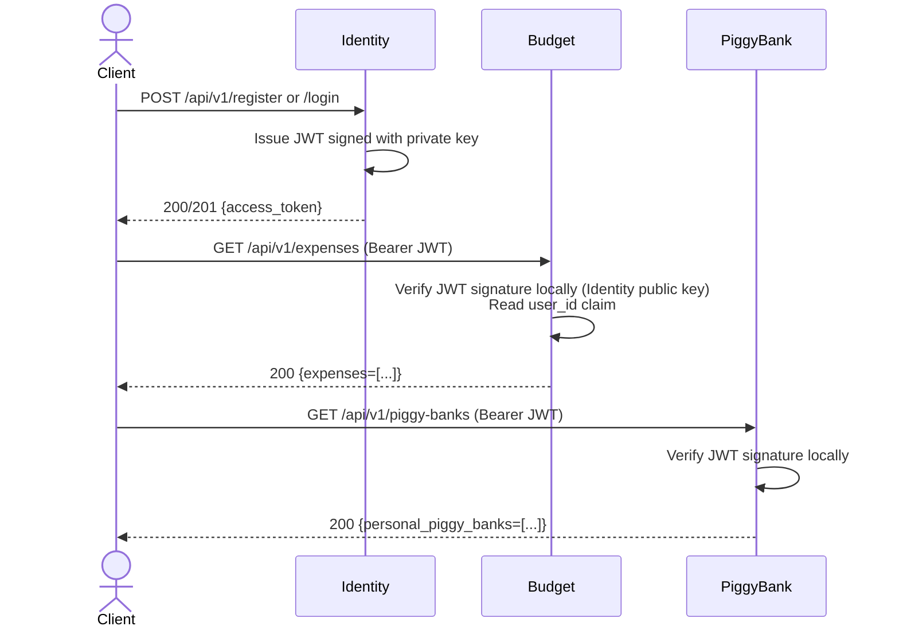
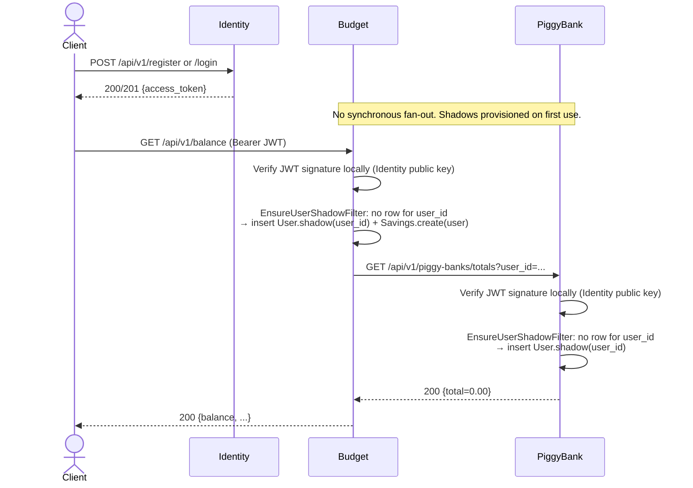
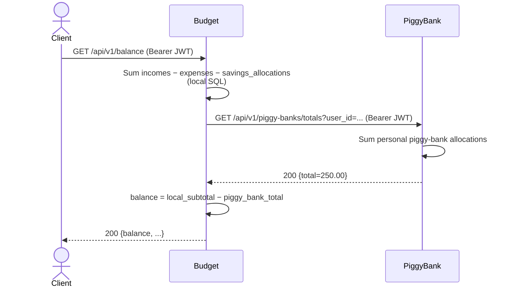
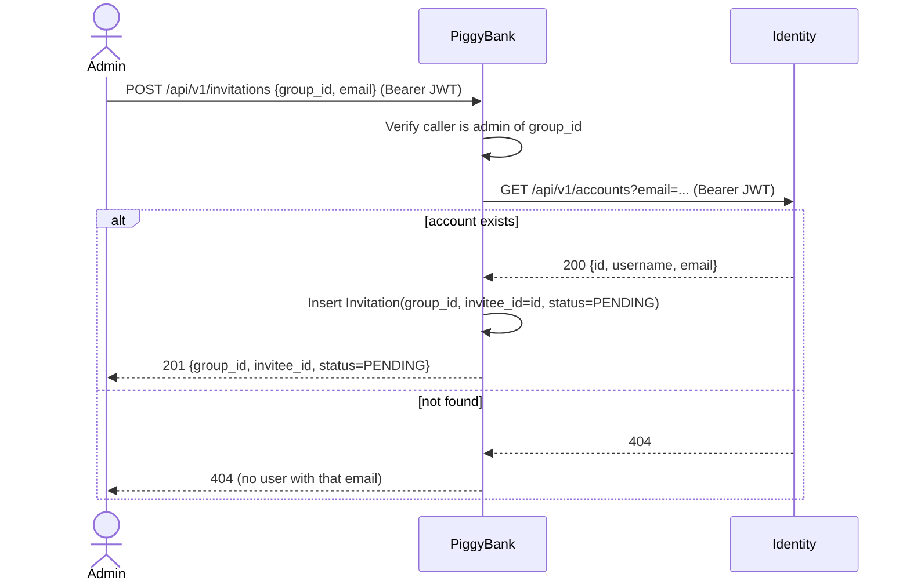

# Deliverable A: Microservices System Design - Budget Management Service

| | |
|---|---|
| **Course** | Service Oriented Software Development in Cloud Computing |
| **Instructor** | E. Giakoumakis, V. Zafeiris |
| **Institution** | Athens University of Economics and Business |
| **Date** | May 2025 |
| **Authors** | Erika Bairami, Ioannis Papadatos, Chrysa Rizeakou |

---

## Table of Contents

1. [Introduction](#1-introduction)
2. [Decomposition Rationale](#2-decomposition-rationale)
3. [Per-service Role and REST API](#3-per-service-role-and-REST-API)
4. [Microservices Interactions](#4-microservices-interactions)

---

## 1. Introduction

The starting point is `budget-management-service` from the previous course, a single-process monolith covering registration/login, personal income & expense tracking (one-off and recurring), a personal savings account, and a group-shared *piggy bank* feature with invitations.

For deliverable A, we redesigned that system as **three independently deployable microservices**:
- **Identity Service** owns credential storage, registration, login, and JWT issuance.
- **PiggyBank Service** owns groups, invitations, personal & group piggy banks, and piggy bank allocations.
- **Budget Service** owns incomes, expenses, recurring incomes & expenses, savings, and the composite balance view.

This document covers, in order: the rationale for the split (§2), the per-service role and REST API (§3), and the inter-service interactions with sequence diagrams (§4).

---

## 2. Decomposition Rationale

### 2.1 Bounded contexts

The decomposition follows the DDD-driven approach recommended by the literature: map each microservice to one bounded context. Three bounded contexts emerge naturally from the monolith's domain:

| Bounded context | Business capability                                                                                 | Entities                                                                                            |
|---|-----------------------------------------------------------------------------------------------------|-----------------------------------------------------------------------------------------------------|
| Identity | Account registration, authentication, and identity lookup.                                          | `UserAccount`                                                                                       |
| Piggy banks | Forming groups, inviting members, managing personal & group piggy banks and their allocations.      | `Group`, `Invitation`, `PiggyBank` (+ `PersonalPiggyBank`, `GroupPiggyBank`), `PiggyBankAllocation` |
| Personal budget tracking | Tracking incomes/expenses, recurring incomes/expenses, the savings account, and the user's balance. | `Income`, `Expense`, `RecurringIncome`, `RecurringExpense`, `Savings`, `SavingsOperation`           |

### 2.2 The shadow-entity pattern

The monolith's `User` entity is a god aggregate that holds direct relationships to almost every other entity, spanning all three bounded contexts. Upon reflection, modelling `User` as the aggregate root for nearly every other entity was a mistake. After getting more experienced with the concept of aggregates, we realized that the real purpose of an aggregate is to enforce invariants that must remain consistent within a single transaction. There is no such invariant binding a user's incomes, expenses, savings, group memberships, and piggy banks into one unit, so each belongs in its own aggregate that would simply reference `User` by id. The split would address this with minimal changes through the shadow-entity pattern: Identity will own the canonical `UserAccount`, and the other two services will keep an id-only shadow `User` entity that will exist solely to satisfy the existing JPA annotations. This is a well-established pattern for monolith-to-microservices migrations, and it has the additional pragmatic benefit of keeping the diff against the existing codebase (and its ~700 tests) minimal.

The pattern has two main benefits:
- It preserves every JPA mapping from the monolith.
- It keeps each service's database fully independent. There would be no shared DB and no cross-service joins, which rules out **common coupling** and **content coupling**.

A separate implementation decision concerns *when* the shadow row is created. We will create it **lazily** on the first authenticated call to a downstream service, rather than have Identity push it on registration. This avoids any direct runtime coupling between PiggyBank/Budget and Identity, which directly improves availability. The check will be performed centrally in a JAX-RS request filter that would read the `user_id` JWT claim, and it will insert the shadow if it is missing, so each resource handler is kept free of this concern.

### 2.3 Anatomy of the split

**Identity Service:** Registration, login, and identity lookup all read and write the same data (`UserAccount`). Also, it is a widely accepted best practice for authentication to live in its own dedicated service following the *Single Responsibility* principle. Concretely, the MicroProfile JWT specification pushes the design in the same direction by mandating **asymmetric cryptography**. The private key used to *sign* tokens lives in a single issuer service and never leaves it, while every other service holds only the public key needed to *verify* signatures. The credential store is contained in the same way: password hashes exist only in Identity's database. Together this draws a real security boundary, since even if PiggyBank or Budget services were ever compromised, the attacker would gain neither the ability to forge tokens nor access to the credentials.

**PiggyBank Service:** The piggy bank hierarchy has to stay together in a single service: `PersonalPiggyBank` and `GroupPiggyBank` are subclasses of `PiggyBank`, and inheritance is the strongest form of coupling between two classes, so splitting the three across services is not really an option. `Group` must then sit alongside `GroupPiggyBank` because the two are extremely **chatty**: every write to a group piggy bank requires verifying that the caller is the admin of the owning group, and every read requires verifying that the caller is a member of it. If they sat in different services, each of these checks would become a synchronous cross-service call (temporal coupling, the worst kind of synchronous coupling for availability). Finally, `Invitation` naturally belongs in the same service, since it only exists as a request to join a specific group, which makes `Group` its anchor at both the data level and the business level. The service then covers a set of closely related business capabilities: forming groups, inviting members, and managing the savings those members share.

**Budget Service:** All entities here share one access pattern: per-user, time-series financial records. `Income`, `Expense`, `RecurringIncome`, `RecurringExpense`, `Savings`, and `SavingsOperation` are all scoped to a single user's personal budget. They also share the same release cadence and will probably change together more often than not, since a change to `Income` is very likely to be mirrored in `Expense`, and the same applies to their recurring counterparts. Cohesion is therefore high: *the code that changes together stays together*. The two existing schedulers (`RecurringIncomeScheduler`, `RecurringExpenseScheduler`) operate entirely within this service's data, so there is no cross-service chatter on the scheduled write path.

### 2.4 Coupling analysis

Every inter-service call after the split is **domain coupling**, which is the weakest and most acceptable form of coupling per Newman's ladder. There are exactly three named outbound interactions:

| Caller | Callee | Endpoint                              | Purpose                                                                                                         |
|---|---|---------------------------------------|-----------------------------------------------------------------------------------------------------------------|
| All clients | Identity | `POST /register`, `POST /login`       | Register or authenticate a user, returning a JWT carrying their `user_id` for use on subsequent requests.       |
| Budget | PiggyBank | `GET /piggy-banks/totals?user_id=...` | Fetch the user's piggy bank totals so the Budget service can include them in the composite balance computation. |
| PiggyBank | Identity | `GET /accounts?email=...`             | Resolve the invitee's email to a `User.id` when creating an invitation.                                         |

There is **no common coupling** (each service will have its own H2 schema and JPA persistence unit), **no content coupling** (no service writes to another's database), and **no pass-through coupling** (no service forwards data it doesn't itself need). JWT verification in PiggyBank and Budget services use the issuer's public key, so token validation is local and there is no temporal coupling on Identity per request.

### 2.5 Independent deployability and team alignment

Because each microservice will own its schema, expose only a REST contract, and run in its own Quarkus process, a change to Budget's internal logic (e.g., adding a new expense category) won't require redeploying PiggyBank or Identity. Independent deployability, which is the central goal of microservices per Newman, is preserved. Three services for a three-person team is also a sensible Conway's-Law alignment: each developer can own one service as their primary responsibility and a second as backup, so that if a teammate is on vacation or otherwise unavailable, someone else can step in and keep the work moving.

---

## 3. Per-Service Role and REST API

All endpoints below are versioned under `/api/v1` and return/accept `application/json`. Endpoints marked **JWT** require an `Authorization: Bearer <token>` header issued by the Identity Service.

### 3.1 Identity Service

**Role:** Handles registration, login, and email-to-user-id resolution. Issues JWTs whose `user_id` claim is the canonical `User` identifier consumed by every other service.

**Owned aggregate:** `UserAccount`.

**Endpoints:**

| Method | Path                         | Auth | Description                                                                              |
|---|------------------------------|---|------------------------------------------------------------------------------------------|
| `POST` | `/api/v1/register`           | None | Register a new user; returns a JWT.                                                      |
| `POST` | `/api/v1/login`              | None | Authenticate the user; returns a JWT.                                                    |
| `GET`  | `/api/v1/accounts?email=...` | JWT (service-to-service) | Resolve an email to a `UserAccount.id`. Used by **PiggyBank** for invitation resolution. |

### 3.2 PiggyBank Service

**Role:** Manages group formation, invitations, and the personal/group piggy bank feature. Authoritative for all piggy bank state.

**Owned aggregates:** 
- `Group`
- `Invitation`
- `PiggyBank` (`PersonalPiggyBank` / `GroupPiggyBank`)
- `PiggyBankAllocation`

Holds a shadow `User(id)` so existing `@ManyToOne User` mappings work with minimal modifications.

**Endpoints:**

| Method | Path | Auth | Description                                                                                          |
|---|---|---|------------------------------------------------------------------------------------------------------|
| `POST`   | `/api/v1/groups` | JWT | Create a group; caller becomes admin.                                                                |
| `GET`    | `/api/v1/groups` | JWT | List groups the caller belongs to.                                                                   |
| `POST`   | `/api/v1/invitations` | JWT | Send an invitation based on email (admin-only). **Calls Identity** to resolve email → `User.id`      |
| `GET`    | `/api/v1/invitations` | JWT | List invitations addressed to the caller; supports.                                                  |
| `PATCH`  | `/api/v1/invitations/{group_id}` | JWT | Accept or reject an invitation.                                                                      |
| `POST`   | `/api/v1/piggy-banks` | JWT | Create a personal piggy bank.                                                                        |
| `DELETE` | `/api/v1/piggy-banks/{id}` | JWT | Delete a personal piggy bank (owner-only).                                                           |
| `POST`   | `/api/v1/piggy-banks/groups/{groupId}/piggy-banks` | JWT | Create a group piggy bank (group admin only).                                                        |
| `POST`   | `/api/v1/piggy-banks/{piggy_bank_id}/allocations` | JWT | Add money to a piggy bank (group members allowed).                                                   |
| `GET`    | `/api/v1/piggy-banks` | JWT | List the caller's piggy banks.                                                                       |group`. |
| `GET`    | `/api/v1/piggy-banks/totals` | JWT (service-to-service) | Sum of caller's allocations across personal piggy banks. Used by **Budget** for balance composition. |

**Outbound REST calls:** `GET /api/v1/accounts?email=...` against Identity Service (only on `POST /invitations`).

### 3.3 Budget Service

**Role:** Manages personal financial transactions and the savings account. Computes the user's balance by combining its own data with piggy bank totals from PiggyBank Service.

**Owned aggregates:** 
- `Income`
- `Expense`
- `RecurringIncome`
- `RecurringExpense`
- `Savings`
- `SavingsOperation`

Holds a shadow `User(id)` so existing `@ManyToOne User` mappings work with minimal modifications.

**Endpoints:**

| Method | Path | Auth | Description |
|---|---|---|---|
| `GET`    | `/api/v1/expenses/categories` | None | Static list of `ExpenseCategory` enum values. |
| `GET`    | `/api/v1/expenses` | JWT | List caller's expenses. |
| `POST`   | `/api/v1/expenses` | JWT | Create an expense. |
| `PUT`    | `/api/v1/expenses/{id}` | JWT | Update an expense (owner-only). |
| `DELETE` | `/api/v1/expenses/{id}` | JWT | Delete an expense (owner-only). |
| `GET`    | `/api/v1/incomes/categories` | None | Static list of `IncomeCategory` enum values. |
| `GET`    | `/api/v1/incomes` | JWT | List caller's incomes. |
| `POST`   | `/api/v1/incomes` | JWT | Create an income. |
| `PUT`    | `/api/v1/incomes/{id}` | JWT | Update an income (owner-only). |
| `DELETE` | `/api/v1/incomes/{id}` | JWT | Delete an income (owner-only). |
| `GET`    | `/api/v1/recurring-expenses` | JWT | List caller's recurring expenses. |
| `POST`   | `/api/v1/recurring-expenses` | JWT | Create a recurring expense. |
| `PATCH`  | `/api/v1/recurring-expenses/{id}` | JWT | Stop a recurring expense. |
| `DELETE` | `/api/v1/recurring-expenses/{id}` | JWT | Delete a recurring expense (owner-only). |
| `GET`    | `/api/v1/recurring-incomes` | JWT | List caller's recurring incomes. |
| `POST`   | `/api/v1/recurring-incomes` | JWT | Create a recurring income. |
| `PATCH`  | `/api/v1/recurring-incomes/{id}` | JWT | Stop a recurring income. |
| `DELETE` | `/api/v1/recurring-incomes/{id}` | JWT | Delete a recurring income (owner-only). |
| `GET`    | `/api/v1/savings` | JWT | Caller's savings account view `{ id, current_amount }`. |
| `POST`   | `/api/v1/savings/allocations` | JWT | Add money to savings. |
| `POST`   | `/api/v1/savings/deallocations` | JWT | Withdraw money from savings. |
| `GET`    | `/api/v1/balance` | JWT | Composite balance = incomes − expenses − savings_allocations − piggy_bank_totals. **Calls PiggyBank** for the latter. |

**Outbound REST calls:** `GET /api/v1/piggy-banks/totals?user_id=...` against PiggyBank Service (only on `GET /balance`).

---

## 4. Microservice Interactions

Synchronous request-response is used throughout: every flow needs the result before responding to the client, so asynchronous styles add no value here.

### 4.1 Independent JWT verification

A successful `POST /register` or `POST /login` returns a JWT signed by the Identity service. From that point on, every call to PiggyBank or Budget services carry the bearer token; both services verify the signature locally against Identity's published public key. There is **no per-request callback to Identity**, which keeps the system loosely coupled in the temporal sense.

### 4.2 Lazy shadow provisioning

Identity service returns the JWT immediately on `POST /register` or `POST /login`, with no synchronous fan-out to PiggyBank or Budget services. Instead, on the user's first authenticated call to a downstream service (in the example below: a `GET /balance`), that service's `EnsureUserShadowFilter` will notice it has no row for `user_id`, it will materialize a shadow `User` (and, for Budget, the per-user `Savings` row), and then proceed with the resource handler.

### 4.3 Get balance: cross-service composition

The headline cross-service call. In the monolith, `User.getCurrentBalance()` queries `Income`, `Expense`, `Savings`, and `PersonalPiggyBank` in one transaction. After the split, the Budget service owns three of those four and asks the PiggyBank service for the fourth:

### 4.4 Send invitation: email-to-user_id resolution

Inviting someone to a group requires knowing their email, the user cannot be expected to know the invitee's `user_id`, so the frontend collects the invitee's email and the backend resolves it to the corresponding `user_id` before saving the invitation. In the monolith this was an in-process repository lookup; after the split it becomes the second documented inter-service call.

