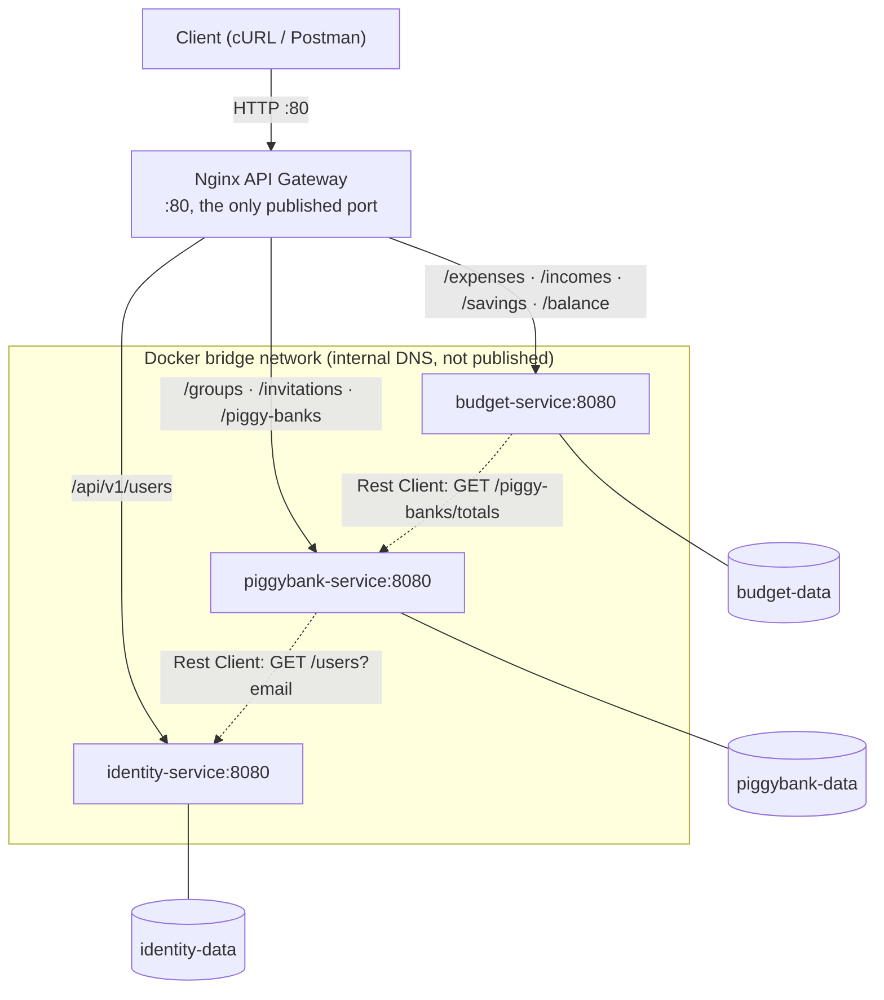

# Deliverable B: Microservices Implementation & Testing - Budget Management System

| | |
|---|---|
| **Course** | Service Oriented Software Development in Cloud Computing |
| **Instructor** | E. Giakoumakis, V. Zafeiris |
| **Institution** | Athens University of Economics and Business |
| **Date** | June 2026 |
| **Authors** | Erika Bairami, Ioannis Papadatos, Chrysa Rizeakou |

---

## Table of Contents

1. [Introduction](#1-introduction)
2. [Phase 1: Monorepo Foundation](#2-phase-1-monorepo-foundation)
3. [Phase 2: Per-Service Implementation](#3-phase-2-per-service-implementation)
4. [Phase 3: Service Integration](#4-phase-3-service-integration)
5. [Phase 4: Gateway and Local Setup](#5-phase-4-gateway-and-local-setup)

---

## 1. Introduction

[Deliverable A](deliverable-a.md) redesigned the original monolith as three independently deployable microservices (**Identity**, **PiggyBank**, and **Budget**) and justified the boundaries between them. Deliverable B turns that design into working software, built on **Quarkus** and the **MicroProfile** APIs mandated by the assignment (JAX-RS, Rest Client, Config, JSON binding, OpenAPI), with persistence on **JPA/Hibernate over H2** and tests written in **JUnit**, **REST Assured**, and **Mockito**.

This document is organized the same way the work actually unfolded, in four phases:
1. **Monorepo Foundation (§2):** Splitting a monolith into three services starts with a repository setup question: three separate repos, each a stripped-down copy of the original, or one monorepo holding three independently deployable modules. We chose the monorepo, for the reasons detailed in §2, and built the shared scaffolding (one build, one Dockerfile, one CI/CD shape) so all three services are built, shipped, and reasoned about the same way.
2. **Per-Service Implementation (§3):** With the structure in place, the goal for each service was narrow and concrete: *make it compile, and make its tests pass, on its own.* This phase covers the domain split, the MicroProfile programming model, the JPA/H2 persistence layer, and the test suites.
3. **Service Integration (§4):** With the services working in isolation, the next step was integration: the synchronous Rest Client calls a service makes when it needs data another owns, and the lazy provisioning of shadow users on a user's first authenticated request.
4. **Gateway and Local Setup (§5):** Finally, an Nginx API Gateway was introduced to hide the underlying backend architecture from our clients, and one bash script brings up the whole system locally via Docker Compose.

---

## 2. Phase 1: Monorepo Foundation

### 2.1 Repository structure and Git history

All three services live in a **single Git repository**, organized as a multi-module Maven project under `services/`, with a parent POM that pins the Quarkus platform BOM and the shared plugin/dependency versions in a single place. The structure was based on the [`razum90/maven-monorepo-example`](https://github.com/razum90/maven-monorepo-example) template.

Splitting the monolith into modules meant relocating each file into the directory of the service it belongs to. Each file was moved with **`git mv`** in a commit that did nothing else, so the rename stays detectable and `git log --follow` can still trace its history through the monolith.

The monorepo was the right fit for us for the following reasons:
- **Atomic cross-cutting changes:** A cross-cutting change, bumping the Quarkus version, changing a JWT claim, or a feature that spans several services, is one commit, one review, one merge, instead of a choreographed rollout across three repositories.
- **One copy of the shared scaffolding:** A single parent POM, a single Dockerfile (§2.2), and a single reusable CI/CD workflow (§2.3) serve all services, which makes adding a new service easy.

Crucially, a monorepo does **not** compromise the central microservices property of **independent deployability** (Newman). GitHub Actions lets us choose when each service's CI/CD pipeline is triggered: path filters scope every pipeline to its own service, so a pull request rebuilds only the services it actually changed and ships each as its own independently deployable image (§2.3).

This shared scaffolding works so seamlessly largely because all three services run on the same framework. That uniformity is what makes the shared build, Dockerfile, and CI/CD workflow reusable. Microservices are often promoted for allowing each service pick its own language and framework, yet organizations that have run them at scale for years have come to value standardization over that freedom. Netflix is the canonical example: its internal PaaS, the [**"Paved Road"**](https://www.infoq.com/news/2017/06/paved-paas-netflix/), is a standardized yet customizable toolchain that every team is supported on. Their freedom-and-responsibility culture lets any team step off it, but most stay on, because a common, well-supported toolset reduces cognitive load and adds more value than per-team divergence.

### 2.2 A single shared Dockerfile

All three services are containerized by **one Dockerfile** at the repository root, parameterized by a `SERVICE` build argument. This works because every service builds to the same Quarkus JVM output layout (`target/quarkus-app/{lib,*.jar,app,quarkus}`), so a single recipe can containerize any of them: `docker build --build-arg SERVICE=identity-service …`.

The Dockerfile is essentially Quarkus's own auto-generated JVM Dockerfile, which already orders its four `COPY` layers from least to most-frequently-changed (libraries first, application classes last) so that rebuilding after a code change reuses the cached dependency layers. We kept that ordering and made two deliberate additions:
1. A **`SERVICE` build argument** that selects which module's `quarkus-app` output to copy in.
2. A **`/data` directory**, created and handed to the non-root runtime user to serve as the mount point for the file-backed H2 database. This is what lets a service's data **persist across container restarts** when paired with a named volume (§5.2).

Keeping one shared Dockerfile is a real consistency win: there is exactly one place to patch a base-image CVE or change the JVM options for every service at once. The tradeoff is that a service needing a different runtime shape (a native build, a non-JVM language) would need its own Dockerfile, which is a price worth paying only if and when it arises.

### 2.3 Per-service Continuous Integration & Delivery pipelines

Each service has its **own** GitHub Actions pipeline (`identity-service.yml`, `piggybank-service.yml`, `budget-service.yml`), each a thin caller of a single **reusable workflow** (`service-workflow.yml`). This is the mechanism that delivers independent deployability inside the monorepo:
- **Path filters:** A service's pipeline triggers only when *its* sources change (`services/<name>/**`), or when genuinely shared resources change (the parent POM, the Dockerfile, the workflow files). The build itself uses `--projects <service> --also-make`, so the Maven reactor compiles only the target module and whatever it depends on.
- **Verify, then deliver:** The reusable workflow runs `mvn verify` (unit + integration tests, with JaCoCo coverage) on every push and pull request. Only on a push does it proceed to build the image and push it to Docker Hub, so pull requests get the full test gate without publishing artifacts.

This is Continuous **Delivery**, not Continuous **Deployment**: the pipeline builds, tests, and publishes an image, but promotion to a running environment stays a deliberate manual step. The image-tagging strategy makes that clean. Every build is pushed under **two tags**:
```
type=raw,value=latest
type=sha,format=short     # immutable, e.g. sha-ec0a8bb, traceable to a commit
```

The commit-pinned tag is the important one: it ties a deployed artifact back to the exact source commit, which is what makes a production deployment auditable and a rollback a one-line change of tag. This two-tag scheme is the bridge we will build on for the Kubernetes deployment in Deliverable C.

---

## 3. Phase 2: Per-Service Implementation

With the monorepo in place, each service became a standalone Quarkus application with one job: **compile cleanly and pass its own test suite.** Each service maintains the hexagonal layout inherited from the monolith: a `domain` core, an `application` layer (use-case services, commands, repository ports), an `infrastructure` layer (JPA repositories, security, schedulers), and a `presentation` layer (JAX-RS resources and filters). The mandated MicroProfile APIs map cleanly onto that structure:

| MicroProfile API | Role within a service | Where it lives                              |
|------------------|---|---------------------------------------------|
| **JAX-RS**       | Describes and publishes the REST endpoints | `presentation/api/resources`                |
| **Config**       | Externalizes every environment-specific value | `application.properties` + env overrides    |
| **JSON-P/B**     | Maps Java records to/from JSON | DTO records in `presentation`/`application` |
| **OpenAPI**      | Auto-generates the API contract & Swagger UI | Derived from JAX-RS annotations             |

*(The fifth mandated API, the **Rest Client**, is inherently about talking to another service, so it belongs to Phase 3.)*

### 3.1 The MicroProfile programming model

**JAX-RS:** A JAX-RS *resource* is a Java class annotated with `@Path` that groups the endpoints of a single REST resource under a shared base URL. Within it, each endpoint is a method carrying the matching HTTP-verb annotation (`@GET`, `@POST`, `@PUT`, `@PATCH`, `@DELETE`) and, where needed, its own sub-path. Resources are thin: they pull the authenticated `user_id` from the validated JWT, build an application-layer *command*, delegate to a use-case service, and wrap the result in the correct HTTP status. Error handling is centralized: a set of `@ServerExceptionMapper` methods translate domain and application exceptions into a uniform JSON error body (`{ status, message, timestamp }`) with the right status code (`AlreadyExistsException` to `409`, `NotFoundDomainException` to `404`), so resources carry no `try/catch` clutter and the failure-to-status mapping lives in exactly one place.

**Config:** All environment-specific and security-sensitive values are externalized through MicroProfile Config into each service's `application.properties`, for example: the datasource URL, the JWT issuer and token age, and, most importantly, the **key locations** for JWT signing/verification. Config's **profile** mechanism (`%dev`, `%test`, and the default for production) lets one file describe all three environments. Because Config also reads environment variables at a higher priority than the `application.properties` file, the *same* container image can be repointed at a different database or keys using environment variables, which is exactly what makes the images portable.

**JSON-P/B:** Requests and responses are immutable Java **records** (for example `RegisterUserRequest`, `ExpenseRepresentation`). Quarkus JSON layer (the Jackson provider, `quarkus-rest-jackson`) handles serialization & deserialization automatically. Because the public API uses `snake_case` while the Java records use `camelCase`, the `@JsonProperty("current_amount")` annotation bridges the names wherever they differ. Splitting *request* records from *response* records lets the inbound and outbound contracts evolve independently and keeps the internal domain entities from leaking to clients.

**OpenAPI:** Each service ships with `quarkus-smallrye-openapi`, which derives an OpenAPI 3 document directly from the JAX-RS annotations, so there is no separate spec to maintain and no drift between docs and code. The document is served at `/q/openapi`, with an interactive Swagger UI at `/q/swagger-ui` during development. A single Config property (`quarkus.smallrye-openapi.security-scheme-name=JWT`) plus a `@SecurityRequirement(name = "JWT")` annotation on the secured resources makes the bearer-token requirement explicit in the contract. The Swagger UI is excluded from production builds by default, which is the right posture.

### 3.2 Persistence: JPA and H2, one database per service

Data access uses the Java Persistence API via Hibernate ORM (with Panache). Crucially, **each service owns its own H2 database and its own persistence unit**: `identity`, `piggybank`, and `budget` are three separate schemas with no shared tables and no cross-service joins. Separate databases are what make the decoupling advocated in Deliverable A real: no service can read or write another's tables, so the only way to another service's data is through its REST API. The `%test` profile runs H2 in-memory, while the default profile keeps it file-backed under the mounted `/data` directory so data survives restarts.

### 3.3 Making it compile: splitting the `User` god-aggregate

The single largest code change, and the one that had to land before anything could compile, was distributing the monolith's `User` entity responsibilities. In the monolith, `User` was an aggregate root with direct JPA relationships to nearly every other entity across all three bounded contexts. The split, as designed in Deliverable A, gives each service a `User` that owns **only the relationships belonging to its own bounded context**:
- **Identity** owns the *canonical* user account: `username`, `email`, hashed `password`, and the generated identifier that becomes the `user_id` JWT claim.
- **PiggyBank** keeps an id-only **shadow** `User` that anchors its `groups`, `piggyBanks`, and `invitations` associations.
- **Budget** keeps an id-only **shadow** `User` that anchors its `incomes`, `expenses`, `recurringIncomes`, `recurringExpenses`, and `savings` associations.

Because each service's `User` entity still carries exactly the JPA annotations its own entities expect, every `@ManyToOne`/`@OneToMany` mapping inherited from the monolith continues to compile and behave identically, which is what kept the blast radius of this migration small.

### 3.4 Making the tests pass

The test suite is a pyramid, with each layer exercised at the cheapest level that can meaningfully cover it. At this stage each service is tested in isolation, since the inter-service calls will be implemented in Phase 3:
- **Domain unit tests:** plain JUnit over entities and value objects (`Money`, `EmailAddress`, `Password`, balance computation, allocation rules). No framework, no database.
- **Application service tests:** `@QuarkusTest`s that invoke each use-case service directly to exercise its business logic against an in-memory H2 database, with every test wrapped in `@TestTransaction` so its writes roll back afterward. No HTTP is involved.
- **Integration tests:** `@QuarkusTest`s that exercise each service end-to-end over real HTTP with **REST Assured**, asserting status codes and JSON bodies against an in-memory H2 database that is `drop-and-create` and reseeded (`import.sql`) before each test. These verify the HTTP contract: JAX-RS wiring, JSON binding, validation, and exception mapping working together.

Testing a *secured* service in isolation is made possible by **each service signing its own test JWTs**. The real signing private key lives only in Identity and never leaves it; the tests instead use a **separate RS256 key-pair generated solely for testing** (`testPrivateKey.pem` / `testPublicKey.pem` under `src/test/resources`). Under the `%test` profile, a service signs a token with the test private key and verifies it with the matching test public key, all through a test-scoped `quarkus-smallrye-jwt-build` dependency. This is exactly the asymmetric-crypto trust model described in Deliverable A entirely within a single service's test suite. The net result is that all three test suites, including the ~700 tests carried over from the monolith, run green independently, which is precisely what lets CI/CD build and verify each service on its own (§2.3).

---

## 4. Phase 3: Service Integration

With the services working in isolation, the next step is integration: the synchronous Rest Client calls a service makes when it needs data another owns, and the lazy provisioning of shadow users on a user's first authenticated request.

### 4.1 The MicroProfile Rest Client: the inter-service calls

The split introduced exactly two synchronous service-to-service calls, both identified in Deliverable A as weak *domain coupling*:
- **Budget calls PiggyBank** (`GET /piggy-banks/totals`) to include piggy-bank totals into the total balance.
- **PiggyBank calls Identity** (`GET /users?email=…`) to resolve an invitee's email to a `user_id`.

Each integration is expressed as a small `@RegisterRestClient` Java interface annotated with `@Path`, so the call site reads like a local method invocation while Quarkus generates the HTTP plumbing. The remote base URLs are supplied through Config, so the target host (for example `http://piggybank-service:8080` on the Compose network) is set in configuration, never in code. And because each Rest Client is just an interface, it is easy to swap for a mock when testing the calling service.

### 4.2 Lazy shadow provisioning

A shadow `User` record (§3.3) has to exist before a downstream service can attach any data to it, but we deliberately avoided having *Identity* **push** new users to *PiggyBank* and *Budget* at registration time, since that would introduce runtime coupling and hurt the availability for no real benefit. Instead, each downstream service provisions the shadow `User` **lazily, on the user's first authenticated call**, inside an `EnsureUserShadowFilter`. The filter reads the validated `user_id` from the JWT and, if no row exists for it, inserts one (the Budget variant thereby also creating the `Savings`). Resource handlers stay oblivious.

---

## 5. Phase 4: Gateway and Local Setup

With the services now working together, the final step is to give clients a single, transparent entry point to our system, and to make the whole system seamless to run locally.

### 5.1 The API Gateway

The architecture of the backend should be **transparent to clients** to reduce coupling. A client should see a unified API on a single host, not three separate services on three different hosts. We therefore put an **Nginx** container in front as an API Gateway. It listens on a single port and routes by URL prefix to the appropriate upstream, using Docker's internal DNS to resolve service names: `/api/v1/users` to *Identity*; `/api/v1/groups`, `/api/v1/invitations`, and `/api/v1/piggy-banks` to *PiggyBank*; and the budget-tracking related prefixes to *Budget*. The client never learns a service name or an internal port.



### 5.2 The Docker Compose stack

A **Docker Compose** file ties together the three services and the API Gateway into a single stack for local use. The setup makes one deliberate choice: **only the gateway's port is published to the host.** The service containers are not reachable from the host directly. All traffic between them, both the gateway forwarding a request inward and the **service-to-service Rest Client calls of §4.1**, travels over the **default bridge network** that Compose creates for the stack, with its built-in DNS resolving each service by its container name. Each service also mounts a **named volume** at `/data`, so its H2 database survives `docker compose down`/`up`.

This Compose file is tuned for **development**: it `build`s the images from the current source on every run, so a developer always runs their latest code. A file meant for an actual single-host *deployment* would differ in one respect: instead of `build:` blocks it would reference the **published images by their immutable `:sha-…` tag** (§2.3), so the running stack is a known, traceable artifact.

### 5.3 Getting started

Standing the whole system up locally takes a single command, given three prerequisites:
- **Java 17**, the version the services target.
- **Maven**, because the convenience script invokes `mvn` directly rather than the project's Maven Wrapper.
- **Docker** (with Compose v2).

With those in place, one **bash script** runs the two steps that must happen in order (the Quarkus image build expects `mvn package` to have already produced the `quarkus-app` layout): it builds the services with Maven, then brings the Compose stack up, building fresh images from the current source:
```bash
./services/docker-compose.sh
```

Once it finishes, the entire system is reachable on the host through the gateway on port `80`. The functionality of every endpoint can then be exercised with **Postman**, using the [`Budget Management.postman_collection.json`](Budget%20Management.postman_collection.json) collection included in the repository root.

The collection is built to run end-to-end against **fresh databases**: every request is prefixed with the order in which it should be executed (`01) Register 201 (erika)`, `02) Register 201 (ioannis)`, `03) Register 409 (username taken)`, and so on), so the **Collection Runner** can execute the whole suite top to bottom in one pass. It is organized into three folders, one per service, and walks each endpoint through both its **happy path** and its documented **exception cases**. JWTs and autogenerated resource IDs are captured automatically into collection variables by per-request test scripts, so no value ever has to be copied by hand, and the only variable to set is `baseUrl` (default `http://localhost`).