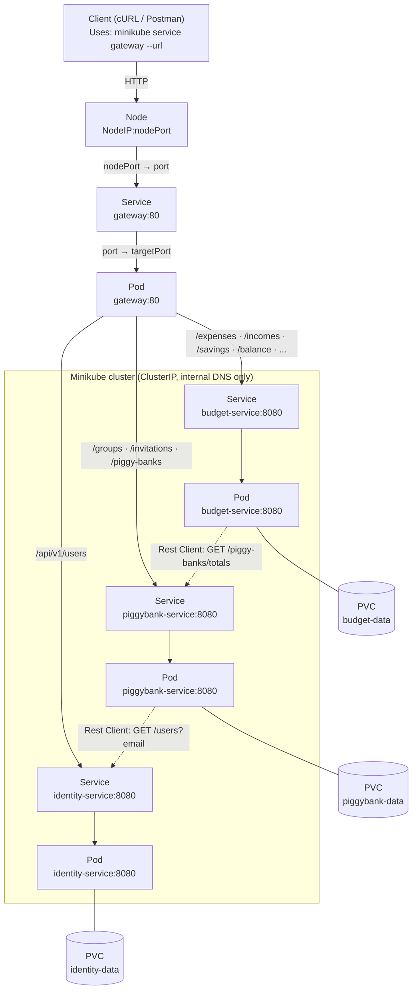

# Deliverable C: Cloud Deployment on Kubernetes - Budget Management System

| | |
|---|---|
| **Course** | Service Oriented Software Development in Cloud Computing |
| **Instructor** | E. Giakoumakis, V. Zafeiris |
| **Institution** | Athens University of Economics and Business |
| **Date** | June 2026 |
| **Authors** | Erika Bairami, Ioannis Papadatos, Chrysa Rizeakou |

---

## Table of Contents

1. [Introduction](#1-introduction)
2. [From Docker Compose to Kubernetes](#2-from-docker-compose-to-kubernetes)
3. [Kubernetes Manifests and the Image-Tag Problem](#3-kubernetes-manifests-and-the-image-tag-problem)
4. [The Recreate Strategy and the H2 Single-Writer Constraint](#4-the-recreate-strategy-and-the-h2-single-writer-constraint)
5. [Health Checks and Kubernetes Probes](#5-health-checks-and-kubernetes-probes)
6. [Bringing the Cluster Up and Verifying It](#6-bringing-the-cluster-up-and-verifying-it)
7. [Fault Tolerance for the Cross-Service Calls](#7-fault-tolerance-for-the-cross-service-calls)

---

## 1. Introduction

...

---

## 2. From Docker Compose to Kubernetes

The migration can best be understood as a translation, where every concept from the Compose stack has a direct Kubernetes counterpart.

| Docker Compose (Deliverable B) | Kubernetes (Deliverable C) |
|---|---|
| A `service` built from the Dockerfile | A **Deployment** (manages the pod that runs the image) plus a **Service** (a stable network identity) |
| Named volume mounted at `/data` | A **PersistentVolumeClaim** mounted at `/data` |
| Compose bridge network, DNS by `service` name | Cluster networking, DNS by **Service name** |
| Only the gateway's port published to the host | Gateway exposed via a **NodePort**; the three services stayed **ClusterIP** (in-cluster only) |
| `docker compose up --build` | `kubectl apply -k` of each service's overlay |
| Single host | Single-node Minikube cluster |

Two parts of the system relied on Compose's name-based DNS, and both survived the migration to Kubernetes untouched:
- **The Rest Client base URLs:** The `budget-service` still calls the `piggybank-service`, and the `piggybank-service` still calls the `identity-service`, by the same hostnames over the same cluster DNS.
- **The gateway's `nginx.conf`:** Its upstreams point at `identity-service:8080`, `piggybank-service:8080`, and `budget-service:8080`, the `service` names from the Compose file. Because each Kubernetes **Service** is named identically and cluster DNS resolves it under that name, the gateway configuration needed no edits.

The resulting topology mirrors the Deliverable B's diagram, now expressed in Kubernetes objects: the gateway is the only externally reachable component, and everything else talks over internal **Service** DNS.



---

## 3. Kubernetes Manifests and the Image-Tag Problem

### 3.1 The problem: one manifest, two environments

Every Kubernetes Deployment must name the container image its Pods will run:

```yaml
image: papajohn77/identity-service:???
```

What goes after the colon pulls in two opposite directions:

- **In Minikube (dev)**, we want whatever was just built locally, because we are iterating on the code.
- **In production**, we want an immutable, traceable tag such as `papajohn77/identity-service:sha-ec0a8bb`, so the running version is always provable, auditable, and one revert away from a rollback. This is exactly the commit-pinned tag the CI/CD pipeline already produces (§2.3 of Deliverable B).

### 3.2 Why the obvious answers don't work

**Idea 1 — Use `:latest` in the manifest, let Kubernetes always pull the newest:**
- The `:latest` tag defaults `imagePullPolicy` to `Always`, so Kubernetes pulls `:latest` from Docker Hub on every pod start. In Minikube this returns the last image CI pushed rather than the one just built locally, so the local build is silently ignored.
- Even in prod, `:latest` is mutable. Two pods scheduled at different times can run different code, and there is no way to roll back to a specific version ("which `:latest`?"). The best practice is to never deploy `:latest`.

**Idea 2 — Maintain two copies of the manifest (`k8s-dev/deployment.yml`, `k8s-prod/deployment.yml`):**
- This works, but ~90% of the two files are identical. Change a probe → update both → eventually forget one → drift between environments.
- The actual differences (image tag, maybe replicas) get buried in 60 lines of duplicated YAML, so what's environment-specific isn't visible at a glance.

**Idea 3 — Keep one manifest, hand-edit the tag with `sed` before applying:**
- The file in git no longer matches what got deployed. The committed manifest says `:placeholder`, but the cluster is running `:sha-ec0a8bb`. This is a disaster for auditing, debugging, and GitOps.

### 3.3 The solution: Kustomize

**Kustomize** is the official Kubernetes tool for this exact problem. Two properties that make it the right fit:
1. **It's built into `kubectl`**, so `kubectl apply -k <folder>` works with no extra tool to install and no templating language to learn.
2. **It only ever produces plain YAML**, there is no code generation; `kubectl kustomize <folder>` renders the final manifest so we can verify it is exactly what we expect.

#### The structure

Each service follows the same layout, a `base/` holding the manifest shape that is identical in every environment, and one thin `overlay/` per environment holding only what differs:

```
services/<service>/k8s/
  base/
    deployment.yml          # shared manifest, with no env-specific values
    kustomization.yml       # tells kustomize "here's the base"
  overlays/
    dev/
      kustomization.yml     # tells kustomize "in dev, use tag :dev"
    prod/
      kustomization.yml     # tells kustomize "in prod, use tag :sha-******"
```

#### The files

The base manifest names the image **without a tag**, so the base alone is intentionally not deployable: choosing an environment requires choosing an overlay. Each overlay starts from `base/` and supplies only the image tag, through Kustomize's canonical `images:` block. The dev and prod overlays are identical except for that one line:

```yaml
# overlays/dev/kustomization.yml
apiVersion: kustomize.config.k8s.io/v1beta1
kind: Kustomization
resources:
  - ../../base
images:
  - name: papajohn77/identity-service
    newTag: dev
```

```yaml
# overlays/prod/kustomization.yml
apiVersion: kustomize.config.k8s.io/v1beta1
kind: Kustomization
resources:
  - ../../base
images:
  - name: papajohn77/identity-service
    newTag: sha-ec0a8bb
```

#### `imagePullPolicy: IfNotPresent`

Three pull policies are possible, and `IfNotPresent` is the only one that works well in both environments:
- `Always` — always pull from the registry. This breaks Minikube, where the image was built locally and doesn't exist in the registry.
- `Never` — never pull. Too strict for production's first deploy, where the image still has to be pulled from the registry.
- `IfNotPresent` — pull only when the image isn't already cached on the node. This works for both: in Minikube the image was built straight into the cluster's Docker daemon, so it is already present and no pull is attempted; in production the image is pulled once and then cached.

This is one of the few settings identical in dev and prod, so it lives in `base/`, not in the overlays.

---

## 4. The Recreate Strategy and the H2 Single-Writer Constraint

### 4.1 The binding constraint: H2 file locking

Each service owns a single **file-backed H2 database** under its `/data` mount (§3.2 of Deliverable B). H2 in embedded/file mode acquires an **exclusive lock** when a JVM opens the database file. If a second JVM tries to open the same file, H2 refuses it with `Database may be already in use`. This is the actual binding constraint behind every storage and rollout decision in this section: a file-backed H2 database can have at most one writer.

This is why each service runs as a single replica. Two pods of the same service would mount the same `/data`, open the same H2 file, and H2 would reject the second. Horizontal scaling is therefore capped at one pod per service. Lifting that cap would mean moving to a **server-mode DBMS**, which is out of scope for this iteration.

### 4.2 Encoding the constraint: `Recreate` plus `ReadWriteOncePod`

**Storage layer: `ReadWriteOncePod`.** Each service's PersistentVolumeClaim requests the `ReadWriteOncePod` access mode, the strictest Kubernetes offers: the volume may be mounted read-write by a **single pod** across the whole cluster. This encodes the single-writer constraint in the storage layer as a hard infrastructure invariant.

```yaml
apiVersion: v1
kind: PersistentVolumeClaim
metadata:
  name: identity-data
spec:
  accessModes:
    - ReadWriteOncePod
  resources:
    requests:
      storage: 1Gi
```

**Rollout layer: `strategy.type: Recreate`.** Kubernetes defaults a Deployment to `RollingUpdate`, which starts the new pod **before** terminating the old one, so that downtime can be avoided. With `ReadWriteOncePod` in force, that default deadlocks: while the old pod still holds the volume, the scheduler cannot place the new pod, so it stays `Pending`, with the scheduler reporting `PersistentVolumeClaim with ReadWriteOncePod access mode already in-use by another pod`. Because `RollingUpdate` will not terminate the old pod until the new one is Ready, the rollout never progresses. `Recreate` is the matching strategy because it tears the old pod down completely and releasing the volume, before bringing the new pod up.

```yaml
apiVersion: apps/v1
kind: Deployment
metadata:
  name: identity-service
spec:
  replicas: 1
  strategy:
    type: Recreate
  ...
```

> The **gateway** is the deliberate exception, it is stateless and keeps the default `RollingUpdate`.

### 4.3 Scaling out the budget service would need ShedLock

There is a second obstacle to running more than one replica, specific to the **budget-service**. It runs two in-process scheduled background jobs through the Quarkus scheduler: `RecurringExpenseScheduler` and `RecurringIncomeScheduler`.

With the replica count pinned to one, exactly one scheduler instance exists, so the jobs are safe today. But the cron is wired into the application itself, not into Kubernetes, so **every** pod of the **budget-service** would run its own copy. The moment we scale to N replicas, all N schedulers would fire the same job at the same instant, racing to apply the same recurring entries for the same date, risking double-posting them. Solving this requires **ShedLock**, which lets the schedulers share a lock (a row in a shared store) so that only one pod can acquire it and execute the job on any given time, while the others skip it.

---

## 5. Health Checks and Kubernetes Probes

Kubernetes needs three operational signals from each pod: whether it has finished booting up, whether the running container is broken and must be restarted, and whether it is ready to serve traffic. The services expose these through the **MicroProfile Health API** (implemented by the Quarkus `smallrye-health` extension), which publishes one endpoint per signal, and each Deployment consumes the per-signal endpoints through **probes**.

### 5.1 What we did not write, and why

The `smallrye-health` extension exposes three endpoints out of the box:
- `/q/health/started` - The application is started.
- `/q/health/live` - The application is up and running.
- `/q/health/ready` - The application is ready to serve requests.

Each behaves sensibly by default:
- **Startup:** The default behavior is to aggregate checks with a logical AND, and that AND over an empty set is UP, so `/q/health/started` reports UP the moment the endpoint is reachable, which is the moment Quarkus has finished booting up.
- **Liveness:** The default behavior is to aggregate checks with a logical AND, and that AND over an empty set is UP, so `/q/health/live` reports UP for as long as the process can answer the probe requests.
- **Database readiness:** The Agroal extension already contributes a readiness check named `Database connections health check`, which validates a pooled connection on every `/q/health/ready` probe.

The `/q/health/started` and `/q/health/live` endpoints never report DOWN explicitly. Failure is inferred by the fact that the process cannot answer UP at all (a timeout or a refused connection), which is exactly the signal we want from them.

### 5.2 The one check worth adding: JWT keys (readiness)

The only custom check we added checks if the JWT keys can be loaded. The **identity-service** both issues and verifies tokens, so it loads a private signing key and a public verification key (`smallrye.jwt.sign.key.location` and `mp.jwt.verify.publickey.location`), while the **piggybank-service** and **budget-service** only verify the tokens on the requests they receive, so each loads the public verification key alone (`mp.jwt.verify.publickey.location`). In every case, if the required key material cannot be loaded, the service is running yet unable to perform authentication, something the framework has no built-in check for.

The custom check surfaces as `JWT keys` in the `/q/health/ready` response, next to the Agroal `Database connections health check`. When both checks pass, the aggregate is UP and the pod stays in rotation:

```json
{
    "status": "UP",
    "checks": [
        {
            "name": "JWT keys",
            "status": "UP"
        },
        {
            "name": "Database connections health check",
            "status": "UP",
            "data": {
                "<default>": "UP"
            }
        }
    ]
}
```

However, if the key material cannot be loaded, `JWT keys` reports DOWN with the underlying error in its `data`. Readiness aggregates with a logical AND, so that single DOWN check flips the whole response to DOWN and pulls the pod from rotation, while the database check stays UP and localizes the failure:

```json
{
    "status": "DOWN",
    "checks": [
        {
            "name": "JWT keys",
            "status": "DOWN",
            "data": {
                "error": "Cannot invoke \"java.io.InputStream.read(byte[])\" because \"contentIS\" is null"
            }
        },
        {
            "name": "Database connections health check",
            "status": "UP",
            "data": {
                "<default>": "UP"
            }
        }
    ]
}
```

### 5.3 The probes and their timing

Each service's container declares all three probes. Only the **Startup** probe carries an `initialDelaySeconds`, a brief head start for the JVM before the first check. **Liveness** and **Readiness** probes begin only after the **Startup** has already reported the application up, which also shields a slow boot from being restarted before it is ready.

```yaml
startupProbe:
  httpGet:
    path: /q/health/started
    port: http
  initialDelaySeconds: 5
  periodSeconds: 5
  timeoutSeconds: 3
  failureThreshold: 12
livenessProbe:
  httpGet:
    path: /q/health/live
    port: http
  periodSeconds: 10
  timeoutSeconds: 3
  failureThreshold: 3
readinessProbe:
  httpGet:
    path: /q/health/ready
    port: http
  periodSeconds: 5
  timeoutSeconds: 3
  failureThreshold: 2
```

Each value follows from what a failure of that probe actually costs:

| Probe | Endpoint | Window | Rationale |
|---|---|---|---|
| startup | `/q/health/started` | ~65s to boot (5s delay + 5s × 12) | Generous against the typical 5-20s Quarkus boot. The budget covers application startup only; the image pull happens before the container starts and is not counted. |
| liveness | `/q/health/live` | restart after 30s (10s × 3) | Conservative by design. The remedy is a disruptive restart, so a single transient stall or a long GC pause must not trigger it. |
| readiness | `/q/health/ready` | out of rotation in 10s (5s × 2), back within 5s | Aggressive by design. The remedy is "stop sending traffic", which is cheap and immediately reversible, so reacting quickly is preferred. With the default `successThreshold` of 1, the pod rejoins rotation on the first success after recovery. |

---

## 6. Bringing the Cluster Up and Verifying It

### 6.1 Bring the system up

Beyond the Deliverable B prerequisites (**Java 17**, **Maven**, **Docker**), the cluster also requires **Minikube** and **kubectl**. With those in place, three commands are sufficient to bring the whole system up:

```bash
minikube start --driver=docker
./services/k8s-up.sh
minikube service gateway --url
```

The *first* command starts **Minikube**, our single-node Kubernetes cluster, using the Docker driver, so the node itself runs as a Docker container on the host rather than in a VM.

The *second* is the Kubernetes counterpart of the Deliverable B convenience script, and it runs the steps that must happen in order:
1. `mvn package` builds the three services so the Quarkus `quarkus-app` layout exists for the image build.
2. It points the shell's Docker CLI at **Minikube's own Docker daemon**, so the images are built directly inside the cluster (this is what makes `imagePullPolicy: IfNotPresent` find them with no registry involved; the alternative, `minikube image load`, instead copies a host-built image into the node).
3. It builds the three service images and the gateway image, all tagged `:dev`.
4. It applies each service's dev overlay with `kubectl apply -k`, then issues a `kubectl rollout restart` so the pods pick up the freshly built `:dev` images.

The *third* command prints the externally reachable URL of the gateway's NodePort Service. That URL is the single entry point to the system, exactly as the published gateway port was under Docker Compose.

### 6.2 Verifying with the Postman collection

Because the migration from Docker Compose to Kubernetes changed how the system is deployed and not what it does, the Deliverable B Postman collection is the acceptance test. We take the URL printed by `minikube service gateway --url` and set it as the `{{baseUrl}}` variable of the [`Budget Management.postman_collection.json`](Budget%20Management.postman_collection.json) collection.

Executing the Postman collection against the Minikube cluster passes all the assertions. That is the concrete proof of the migration: the same client, the same requests, and the same assertions that validated the Docker Compose stack now validate the system running on Kubernetes, with the only change being the single `baseUrl` value.

---

## 7. Fault Tolerance for the Cross-Service Calls

Two calls cross a service boundary at runtime, and both are synchronous, blocking Rest Client calls (§2 diagram):
- **budget-service → piggybank-service** => `GET /piggy-banks/totals`
- **piggybank-service → identity-service** => `GET /users?email`

Communication with external systems is inherently unreliable, and that raises the resiliency demands on the application. So we must not let a remote call hang, because a blocking call left waiting pins the resources it runs on, the request's worker thread and a connection from the pool, and one slow or unreachable dependency can drain both. **Timeout** and **Circuit Breaker** (MicroProfile Fault Tolerance, via the Quarkus `smallrye-fault-tolerance` extension) make these calls **fail fast** instead.

### 7.1 The patterns we left out, and the ones we used

**Retry was deliberately not used.** Each remote call runs inside a `@Transactional` service method, so a JDBC connection from the pool is **pinned** for the whole duration of the method, including the remote call. A retry policy would stack several attempts plus back-off onto that same pinned connection, multiplying how long it is held and making **connection-pool starvation** likely even under light concurrency. Dropping retries removes that amplifier.

> Note: Both calls are read-only, so in principle we could restructure each method to perform the remote call first, outside of any transaction, and only then open a short transaction for the local work, keeping the connection out of the pool while waiting on the network. However, for our current situation, the two patterns we have applied are more than sufficient, so we note it as the clean next step if traffic grows.

**Fallback was not applicable.** Neither remote call has a sensible degraded answer:
- For the invitation, there is no way to guess the invitee's id, and without it the invitation cannot be created.
- For the balance, returning a partially correct number would be a silent, **wrong** financial figure. It is obviously better to report that the balance could not be computed than to report an inaccurate one.

**Why Timeout and Circuit Breaker.** Both reinforce **fail-fast**, which is what frees our resources (the request thread and the pinned connection) quickly rather than letting them block on a dependency that cannot answer. The circuit breaker adds one thing a timeout alone cannot: when a dependency is already failing, often because it is overloaded, it stops sending it traffic for a while instead of piling more load onto a service that is already struggling.

### 7.2 The circuit breaker, and why it sits on the service method

A circuit breaker is a state machine over a rolling window of recent outcomes:
- **Closed** (normal): calls pass through. Once the window has enough calls (`requestVolumeThreshold = 4`) and the failure ratio reaches the threshold (`failureRatio = 0.5`, half or more failing), it changes to Open.
- **Open**: calls return immediately with `CircuitBreakerOpenException` without calling the dependency, giving it room to recover. After a cool-down `delay` it moves to Half-Open.
- **Half-Open**: a single trial call is allowed through. If it succeeds the breaker closes, if it fails it opens again.

We placed `@CircuitBreaker` on the **service methods** (`getBalance`, `sendInvitation`), not on the Rest Client interfaces, and the reason was the distinction between a failing dependency and an ordinary business outcome. The Rest Client collapses every non-2xx response into a single `WebApplicationException`, so on the Rest Client side a `404` (the invitee does not exist) is indistinguishable by exception type from a `503`. If the breaker watched the Rest Client directly, those expected business responses would count as failures and could change its state. By keeping the breaker on the service method, the surrounding `try/catch` first translates the business statuses into our own exceptions, `404 → NotFoundException`, which are **not** in the breaker's `failOn` set, so they never count as failures as far as the breaker is concerned. The breaker only ever sees genuine unavailability of the remote dependency.

### 7.3 What counts as "unavailable": the three failOn types

The breaker counts exactly three exception types (`failOn = {WebApplicationException, TimeoutException, ProcessingException}`). Everything else, including the translated business exceptions and the local "not found" lookups, is treated as a normal outcome:
- **`WebApplicationException`** - once the expected business statuses have been caught and translated away, the only responses left in this type are ones a healthy service would not return, chiefly `5xx` server errors. The service answered, but with a server-side failure.
- **`TimeoutException`** (MicroProfile Fault Tolerance) - the call exceeded its time budget. Under normal conditions the response arrives well within that budget, so exceeding it likely points to a deeper issue that may let us waiting for the much longer default read timeout (30 seconds).
- **`ProcessingException`** (JAX-RS) - the call never completed at the transport layer: connection refused, host unreachable, or DNS failure. The failure is at the transport layer rather than in a response, so the service is unreachable, the clearest of the three signals that it is unavailable.

All three mean "the dependency cannot serve this call right now," which is exactly what should drive the breaker to Open. Business exceptions says nothing about the dependency's health, which is exactly why they were excluded.

### 7.4 The timeout duration

Each client method carries `@Timeout(value = 2, unit = SECONDS)` (`IdentityClient.findByEmail`, `PiggyBankClient.getTotals`). Both are trivial reads, a single indexed lookup and a small sum, whose healthy latency is in the tens of milliseconds. The timeout is therefore sized to bound how long we should wait on a **stalled** remote dependency and, because the call is inside `@Transactional`, how long the pooled connection stays pinned. Two seconds is a deliberate, generous multiple over healthy latency, large enough that a transient pause (a GC pause, a cold connection, cluster network jitter) won't reach it falsely, yet small enough to release the connection and feed the breaker within a few seconds.

### 7.5 Exercising the patterns: runtime-switchable fault simulation

To simulate the downstream dependencies misbehaving on demand, we used a textbook **Strategy Pattern**:
- A `SimulatedCondition` interface with a single `apply()` operation.
- Three strategies: `HealthyCondition` (a no-op, the service behaves normally), `SlowCondition` (sleeps for a configurable delay, default 5 seconds, to drive the caller's timeout), and `FailingCondition` (throws a `503`, to drive the caller's circuit breaker).
- A `ConditionSimulator` holds the current strategy in an `AtomicReference`, defaulting to `HealthyCondition`. The instrumented endpoint calls `simulate()`, which applies whatever strategy is currently selected, before doing its real work.

The benefit of using this pattern is that it allow us to switch strategies at **runtime**. A `PUT` endpoint under the provider's `/simulate` path takes an enum (`HEALTHY`, `SLOW`, `FAILING`) and swaps the live strategy at runtime. Changing the simulated condition requires no restart, no redeploy, and no configuration reload.

Because an endpoint that can make a service fail on command must never be reachable in production, it is guarded by a **feature flag that is closed by default**:

```properties
feature.condition-simulation.enabled=false
```

--

