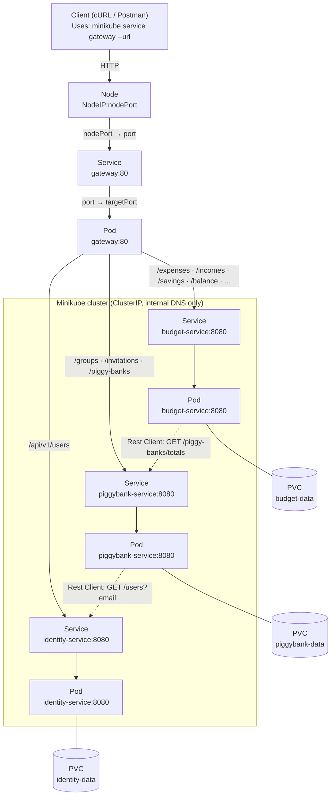

# Deliverable C: Cloud Deployment on Kubernetes - Budget Management System

| | |
|---|---|
| **Course** | Service Oriented Software Development in Cloud Computing |
| **Instructor** | E. Giakoumakis, V. Zafeiris |
| **Institution** | Athens University of Economics and Business |
| **Date** | June 2026 |
| **Authors** | Erika Bairami, Ioannis Papadatos, Chrysa Rizeakou |

---

## Table of Contents

1. [Introduction](#1-introduction)
2. [From Docker Compose to Kubernetes](#2-from-docker-compose-to-kubernetes)
3. [Kubernetes Manifests and the Image-Tag Problem](#3-kubernetes-manifests-and-the-image-tag-problem)
4. [The Recreate Strategy and the H2 Single-Writer Constraint](#4-the-recreate-strategy-and-the-h2-single-writer-constraint)
5. [Bringing the Cluster Up and Verifying It](#5-bringing-the-cluster-up-and-verifying-it)

---

## 1. Introduction

...

---

## 2. From Docker Compose to Kubernetes

The migration can best be understood as a translation, where every concept from the Compose stack has a direct Kubernetes counterpart.

| Docker Compose (Deliverable B) | Kubernetes (Deliverable C) |
|---|---|
| A `service` built from the Dockerfile | A **Deployment** (manages the pod that runs the image) plus a **Service** (a stable network identity) |
| Named volume mounted at `/data` | A **PersistentVolumeClaim** mounted at `/data` |
| Compose bridge network, DNS by `service` name | Cluster networking, DNS by **Service name** |
| Only the gateway's port published to the host | Gateway exposed via a **NodePort**; the three services stayed **ClusterIP** (in-cluster only) |
| `docker compose up --build` | `kubectl apply -k` of each service's overlay |
| Single host | Single-node Minikube cluster |

Two parts of the system relied on Compose's name-based DNS, and both survived the migration to Kubernetes untouched:
- **The Rest Client base URLs:** The `budget-service` still calls the `piggybank-service`, and the `piggybank-service` still calls the `identity-service`, by the same hostnames over the same cluster DNS.
- **The gateway's `nginx.conf`:** Its upstreams point at `identity-service:8080`, `piggybank-service:8080`, and `budget-service:8080`, the `service` names from the Compose file. Because each Kubernetes **Service** is named identically and cluster DNS resolves it under that name, the gateway configuration needed no edits.

The resulting topology mirrors the Deliverable B's diagram, now expressed in Kubernetes objects: the gateway is the only externally reachable component, and everything else talks over internal **Service** DNS.



---

## 3. Kubernetes Manifests and the Image-Tag Problem

### 3.1 The problem: one manifest, two environments

Every Kubernetes Deployment must name the container image its Pods will run:

```yaml
image: papajohn77/identity-service:???
```

What goes after the colon pulls in two opposite directions:

- **In Minikube (dev)**, we want whatever was just built locally, because we are iterating on the code.
- **In production**, we want an immutable, traceable tag such as `papajohn77/identity-service:sha-ec0a8bb`, so the running version is always provable, auditable, and one revert away from a rollback. This is exactly the commit-pinned tag the CI/CD pipeline already produces (§2.3 of Deliverable B).

### 3.2 Why the obvious answers don't work

**Idea 1 — Use `:latest` in the manifest, let Kubernetes always pull the newest:**
- The `:latest` tag defaults `imagePullPolicy` to `Always`, so Kubernetes pulls `:latest` from Docker Hub on every pod start. In Minikube this returns the last image CI pushed rather than the one just built locally, so the local build is silently ignored.
- Even in prod, `:latest` is mutable. Two pods scheduled at different times can run different code, and there is no way to roll back to a specific version ("which `:latest`?"). The best practice is to never deploy `:latest`.

**Idea 2 — Maintain two copies of the manifest (`k8s-dev/deployment.yml`, `k8s-prod/deployment.yml`):**
- This works, but ~90% of the two files are identical. Change a probe → update both → eventually forget one → drift between environments.
- The actual differences (image tag, maybe replicas) get buried in 60 lines of duplicated YAML, so what's environment-specific isn't visible at a glance.

**Idea 3 — Keep one manifest, hand-edit the tag with `sed` before applying:**
- The file in git no longer matches what got deployed. The committed manifest says `:placeholder`, but the cluster is running `:sha-ec0a8bb`. This is a disaster for auditing, debugging, and GitOps.

### 3.3 The solution: Kustomize

**Kustomize** is the official Kubernetes tool for this exact problem. Two properties that make it the right fit:
1. **It's built into `kubectl`**, so `kubectl apply -k <folder>` works with no extra tool to install and no templating language to learn.
2. **It only ever produces plain YAML**, there is no code generation; `kubectl kustomize <folder>` renders the final manifest so we can verify it is exactly what we expect.

#### The structure

Each service follows the same layout, a `base/` holding the manifest shape that is identical in every environment, and one thin `overlay/` per environment holding only what differs:

```
services/<service>/k8s/
  base/
    deployment.yml          # shared manifest, with no env-specific values
    kustomization.yml       # tells kustomize "here's the base"
  overlays/
    dev/
      kustomization.yml     # tells kustomize "in dev, use tag :dev"
    prod/
      kustomization.yml     # tells kustomize "in prod, use tag :sha-******"
```

#### The files

The base manifest names the image **without a tag**, so the base alone is intentionally not deployable: choosing an environment requires choosing an overlay. Each overlay starts from `base/` and supplies only the image tag, through Kustomize's canonical `images:` block. The dev and prod overlays are identical except for that one line:

```yaml
# overlays/dev/kustomization.yml
apiVersion: kustomize.config.k8s.io/v1beta1
kind: Kustomization
resources:
  - ../../base
images:
  - name: papajohn77/identity-service
    newTag: dev
```

```yaml
# overlays/prod/kustomization.yml
apiVersion: kustomize.config.k8s.io/v1beta1
kind: Kustomization
resources:
  - ../../base
images:
  - name: papajohn77/identity-service
    newTag: sha-ec0a8bb
```

#### `imagePullPolicy: IfNotPresent`

Three pull policies are possible, and `IfNotPresent` is the only one that works well in both environments:
- `Always` — always pull from the registry. This breaks Minikube, where the image was built locally and doesn't exist in the registry.
- `Never` — never pull. Too strict for production's first deploy, where the image still has to be pulled from the registry.
- `IfNotPresent` — pull only when the image isn't already cached on the node. This works for both: in Minikube the image was built straight into the cluster's Docker daemon, so it is already present and no pull is attempted; in production the image is pulled once and then cached.

This is one of the few settings identical in dev and prod, so it lives in `base/`, not in the overlays.

---

## 4. The Recreate Strategy and the H2 Single-Writer Constraint

### 4.1 The binding constraint: H2 file locking

Each service owns a single **file-backed H2 database** under its `/data` mount (§3.2 of Deliverable B). H2 in embedded/file mode acquires an **exclusive lock** when a JVM opens the database file. If a second JVM tries to open the same file, H2 refuses it with `Database may be already in use`. This is the actual binding constraint behind every storage and rollout decision in this section: a file-backed H2 database can have at most one writer.

This is why each service runs as a single replica. Two pods of the same service would mount the same `/data`, open the same H2 file, and H2 would reject the second. Horizontal scaling is therefore capped at one pod per service. Lifting that cap would mean moving to a **server-mode DBMS**, which is out of scope for this iteration.

### 4.2 Encoding the constraint: `Recreate` plus `ReadWriteOncePod`

**Storage layer: `ReadWriteOncePod`.** Each service's PersistentVolumeClaim requests the `ReadWriteOncePod` access mode, the strictest Kubernetes offers: the volume may be mounted read-write by a **single pod** across the whole cluster. This encodes the single-writer constraint in the storage layer as a hard infrastructure invariant.

```yaml
apiVersion: v1
kind: PersistentVolumeClaim
metadata:
  name: identity-data
spec:
  accessModes:
    - ReadWriteOncePod
  resources:
    requests:
      storage: 1Gi
```

**Rollout layer: `strategy.type: Recreate`.** Kubernetes defaults a Deployment to `RollingUpdate`, which starts the new pod **before** terminating the old one, so that downtime can be avoided. With `ReadWriteOncePod` in force, that default deadlocks: while the old pod still holds the volume, the scheduler cannot place the new pod, so it stays `Pending`, with the scheduler reporting `PersistentVolumeClaim with ReadWriteOncePod access mode already in-use by another pod`. Because `RollingUpdate` will not terminate the old pod until the new one is Ready, the rollout never progresses. `Recreate` is the matching strategy because it tears the old pod down completely and releasing the volume, before bringing the new pod up.

```yaml
apiVersion: apps/v1
kind: Deployment
metadata:
  name: identity-service
spec:
  replicas: 1
  strategy:
    type: Recreate
  ...
```

> The **gateway** is the deliberate exception, it is stateless and keeps the default `RollingUpdate`.

### 4.3 Scaling out the budget service would need ShedLock

There is a second obstacle to running more than one replica, specific to the **budget-service**. It runs two in-process scheduled background jobs through the Quarkus scheduler: `RecurringExpenseScheduler` and `RecurringIncomeScheduler`.

With the replica count pinned to one, exactly one scheduler instance exists, so the jobs are safe today. But the cron is wired into the application itself, not into Kubernetes, so **every** pod of the **budget-service** would run its own copy. The moment we scale to N replicas, all N schedulers would fire the same job at the same instant, racing to apply the same recurring entries for the same date, risking double-posting them. Solving this requires **ShedLock**, which lets the schedulers share a lock (a row in a shared store) so that only one pod can acquire it and execute the job on any given time, while the others skip it.

---

## 5. Bringing the Cluster Up and Verifying It

### 5.1 Bring the system up

Beyond the Deliverable B prerequisites (**Java 17**, **Maven**, **Docker**), the cluster also requires **Minikube** and **kubectl**. With those in place, three commands are sufficient to bring the whole system up:

```bash
minikube start --driver=docker
./services/k8s-up.sh
minikube service gateway --url
```

The *first* command starts **Minikube**, our single-node Kubernetes cluster, using the Docker driver, so the node itself runs as a Docker container on the host rather than in a VM.

The *second* is the Kubernetes counterpart of the Deliverable B convenience script, and it runs the steps that must happen in order:
1. `mvn package` builds the three services so the Quarkus `quarkus-app` layout exists for the image build.
2. It points the shell's Docker CLI at **Minikube's own Docker daemon**, so the images are built directly inside the cluster (this is what makes `imagePullPolicy: IfNotPresent` find them with no registry involved; the alternative, `minikube image load`, instead copies a host-built image into the node).
3. It builds the three service images and the gateway image, all tagged `:dev`.
4. It applies each service's dev overlay with `kubectl apply -k`, then issues a `kubectl rollout restart` so the pods pick up the freshly built `:dev` images.

The *third* command prints the externally reachable URL of the gateway's NodePort Service. That URL is the single entry point to the system, exactly as the published gateway port was under Docker Compose.

### 5.2 Verifying with the Postman collection

Because the migration from Docker Compose to Kubernetes changed how the system is deployed and not what it does, the Deliverable B Postman collection is the acceptance test. We take the URL printed by `minikube service gateway --url` and set it as the `{{baseUrl}}` variable of the [`Budget Management.postman_collection.json`](Budget%20Management.postman_collection.json) collection.

Executing the Postman collection against the Minikube cluster passes all the assertions. That is the concrete proof of the migration: the same client, the same requests, and the same assertions that validated the Docker Compose stack now validate the system running on Kubernetes, with the only change being the single `baseUrl` value.
